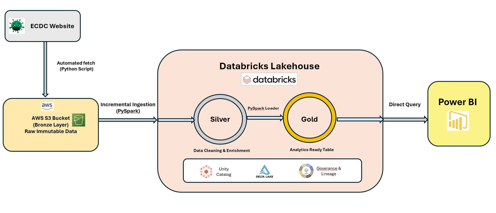
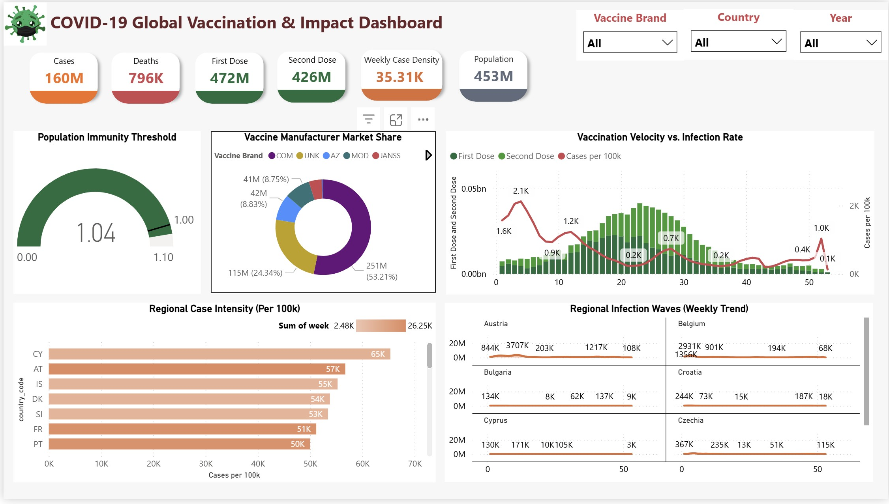

# 🦠 COVID-19 Global Health Intelligence — End-to-End Data Engineering with Databricks
**AWS S3 | Databricks Lakehouse | PySpark | Medallion Architecture**

## 📌 Project Overview
**COVID-19 Global Health Intelligence** is a production-grade data engineering solution that synchronizes global vaccination rollouts with infection trends. The project utilizes a **hybrid architecture**, leveraging **AWS S3** for raw data storage (Bronze) and **Databricks** for sophisticated transformation (Silver) and analytical serving (Gold). 

This implementation demonstrates expert-level handling of many-to-many data relationships and the successful synchronization of brand-specific vaccine metrics with regional health data.

---

## 🏗️ System Architecture
The pipeline follows a refined **Medallion Architecture** to ensure data quality and reliability:



* **Data Acquisition**: Automated retrieval of global health datasets from the **ECDC** website.
* **Bronze (S3 Raw Layer)**: Ingested raw CSV files directly into an **AWS S3 landing zone**, maintaining the data in its immutable, original state for auditing and lineage.
* **Silver (Databricks Enrichment)**: Fetched raw S3 data using **PySpark notebooks** for schema enforcement, timestamp normalization, and data cleansing. This layer handles administrative data lags and prepares the grain for multi-dimensional analysis.
* **Gold (Analytics Serving)**: Aggregates refined Silver data into business-ready tables optimized for **SQL Dashboards** and high-performance **DirectQuery** reporting in Power BI.

---

## 🚀 Key Technical Highlights
* **Cross-Platform Orchestration**: Successfully bridged AWS S3 storage with Databricks compute using PySpark for seamless ETL execution.
* **Incremental Processing**: Engineered the Silver layer notebooks to process updates while maintaining data integrity across disparate regional health metrics.
* **Data Enrichment**: Optimized the join phase to pull descriptive country names from the Cases table to enrich a code-only Vaccine dataset, improving BI readability.
* **Governance & Lineage**: Managed data security and transformation history within the Databricks environment to ensure compliance with health data standards.

---

## 📊 BI Dashboard


The final stage of the pipeline is a high-performance **Power BI Dashboard** connected via **DirectQuery** to the Databricks Gold Layer. This dashboard provides a multi-dimensional view of the pandemic's trajectory, synchronized with global vaccination efforts.

### **Dashboard Technical Breakdown**
* **Technical Executive Summary**: Located in the primary header, this section utilizes **Dynamic DAX Narratives** to provide an immediate situational overview. It surfaces critical metadata and data integrity confirmations, such as the 104.2% administrative population coverage.
* **Population Immunity Threshold**: A gauge visual engineered to track herd immunity progress. The axis is dynamically scaled to **1.10** to accommodate administrative reporting lags where recorded doses exceeded the initial census population.
* **Vaccination Velocity vs. Infection Rate**: A dual-axis time-series chart that correlates supply-side metrics (First/Second doses) with demand-side impacts (Case Density). This visual validates the temporal alignment of the Gold Layer join logic.
* **Regional Case Intensity (Per 100k)**: A normalized bar chart that enables an unbiased "apples-to-apples" comparison of viral impact across European nations of vastly different sizes.
* **Regional Infection Waves**: A "Small Multiples" layout demonstrating the robustness of the **Year-Week** grain synchronization across 20+ independent regions.
* **Manufacturer Market Share**: A distribution analysis reflecting the market penetration of brands like Pfizer (COM) and Moderna (MOD), correctly handling the many-to-many relationship with regional populations.

---

## ⚠️ Engineering Challenges & Solutions

### **1. The "Brand Fan-out" Inflation**
* **Challenge**: Joining vaccine manufacturer data (e.g., Pfizer, Moderna) with regional cases caused a "fan-out" effect, artificially multiplying case counts by the number of brands present.
* **Solution**: Implemented **Defensive DAX** logic using `SUMX` and `SUMMARIZE` in Power BI to virtually deduplicate rows at the `Country-Week` grain, ensuring aggregate KPIs (160M cases) remained accurate regardless of filter context.

### **2. Administrative Data Anomalies**
* **Challenge**: Initial ingestion showed a **104.2% population coverage**, a common anomaly in public health caused by census lags during mass rollouts.
* **Solution**: Validated the anomaly through a Silver-layer audit. Instead of removing data, I adjusted the **Population Immunity Gauge** axis to **1.10** and implemented smart narratives to explain the administrative surplus to stakeholders.

---

## ⚙️ Setup Instructions

### **1️⃣ AWS S3 Setup**
* Create an S3 bucket (e.g., `covid-raw-bronze`).
* Upload raw ECDC CSV files into the designated landing folders.

### **2️⃣ Databricks Workspace Setup**
* Connect the S3 bucket to Databricks using an Instance Profile or Mount Point.
* Import the **PySpark Notebooks** for the Silver and Gold layers.
* Execute the initialization scripts to establish schemas in the Metastore/Unity Catalog.

### **3️⃣ Pipeline Execution**
* Run the **Silver Notebook** to fetch raw S3 data and perform cleansing.
* Run the **Gold Notebook/SQL Scripts** to generate the final analytical views.

---

## 📁 Repository Structure
```text
├── notebooks/
│   ├── covid19_silver_and_gold_transformation.ipynb  # Fetches raw CSV from S3 to databricks 
├── scripts/
│   └── ingest_structured.ipynb  # script to fetch csv files from ecdc website
│   └── project_setup.tf         # terraform file
│   └── requirements.txt         # requirements file
│   └── Setup Details.txt         # project setup instructions
├── data/                          
│   └── EU_covid19_data_cases_deaths_20260131.csv # weekly cases and tests data csv
│   └── eu_covid19_data_testing_20260131.csv      # daily cases and deaths data csv 
│   └── EU_covid19_data_vaccination_20260131.csv  # weekly vaccination data csv 
├── assets/  
│   └── Covid19_Dashboard.jpg     # BI Dashboard
│   └── green-coronavirus      # BI dashboard covid pic
│   └── architecture.png      # architecture diagram
│   └── pipeline.jpg      # pipeline diagram
├── data_dictionary/  
│   └── covid-19-variable-dictionary-and-disclaimer-weekly-testing-data.pdf
│   └── Variable_Definition_COVID-19_vaccination_EUEEA_since_September_2023.pdf 
└── README.md