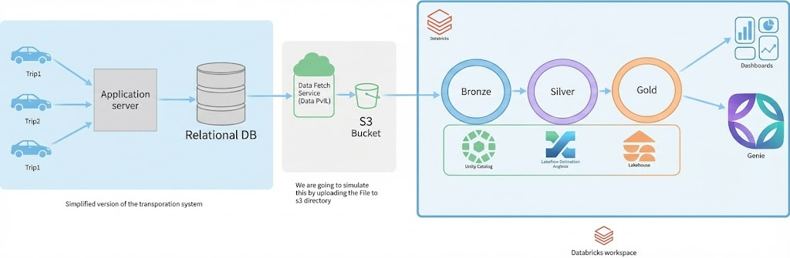

# 🚕 RideOne — End-to-End Data Engineering with Databricks LakeFlow

[](https://www.databricks.com/)
[](https://aws.amazon.com/)
[](https://spark.apache.org/)

## 📌 Project Overview
**RideOne** is a production-ready **Databricks Lakehouse** implementation for a ride-hailing platform.  
It demonstrates **modern data engineering best practices** using **Declarative Pipelines (Delta Live Tables), Medallion Architecture (Bronze → Silver → Gold), incremental ingestion, and data governance**.

## 🏗️ System Architecture
The pipeline follows a structured **Medallion Architecture** to ensure data quality and reliability at every stage:



1.  **Source Data Generation:** Application servers capture trip details and store them in a **Relational Database**.
2.  **Extraction & Landing:** Data is extracted from the DB, converted into **CSV format**, and uploaded to an **AWS S3 Bucket** (Landing Zone).
3.  **Bronze (Ingestion):** Using **Auto Loader**, Databricks incrementally ingests raw CSV files from S3, utilizing `PERMISSIVE` mode to handle malformed records without pipeline failure.
4.  **Silver (Enrichment):** Performs cleaning, standardizing, and enrichment. This includes a dynamic **Calendar Dimension** and **Change Data Feed (CDF)** enablement for incremental tracking.
5.  **Gold (Analytics):** Aggregates data into business-ready tables optimized for **SQL Dashboards** and **Databricks Genie** (AI-powered natural language querying).

---
## 🚀 Key Technical Highlights
* **Declarative LakeFlow:** Utilized `dlt` (Delta Live Tables) decorators to manage table dependencies and orchestration automatically.
* **Incremental Ingestion:** Leveraged `cloud_files` (Auto Loader) for efficient, cost-effective ingestion of new data arriving in S3.
* **Dynamic Dimension Modeling:** Developed a scalable Python function to generate a full date dimension with support for dynamic `start_date` and `end_date` parameters.
* **Data Quality (Expectations):** Integrated built-in DLT expectations to enforce data integrity (e.g., non-null IDs) across the Silver layer.
* **Unity Catalog & Governance:** Managed data governance, security, and end-to-end lineage through Unity Catalog.
---

## 🔗 Data Lineage & Pipeline Flow
The following lineage graph, generated by **Databricks LakeFlow**, visualizes the end-to-end dependency management of the Good Cabs project. 


### **Flow Breakdown:**
* **Bronze to Silver:** Raw `trips` and `city` data are ingested and staged for cleaning.
* **Dimensional Join:** The `calendar` dimension (programmatically generated) is joined with the `trips` and `city` datasets to create the core `fact_trips` table.
* **Gold Layer Fan-out:** The pipeline automatically partitions and serves data into city-specific Gold tables (e.g., `fact_trips_surat`, `fact_trips_lucknow`) to support localized business analytics.
---
### **🔍 Node Spotlight: trips_silver_staging**
The `trips_silver_staging` node is the most critical transformation point in the pipeline. It serves three primary functions:
1. **Schema Casting:** Converts raw S3 strings into optimized Spark types (Decimal, Timestamp, Integer).
2. **Integrity Checks:** Filters out invalid trips where pickup times are later than drop-off times.
3. **Deduplication:** Ensures idempotent processing by removing duplicate `trip_id` entries before they reach the Silver fact table.
---

## ⚙️ Setup Instructions

### 1️⃣ Local Setup
```bash
# Clone the repository
git clone <repo_url>
cd rideone

# Optional: create local folder structure for testing
mkdir -p data-store/city data-store/trips
cp city.csv data-store/city/
cp trips.csv data-store/trips/
```
### 2️⃣ Databricks Free Account
1. Create a **Databricks free account**.  
2. Navigate to **Catalog → Connections → Create New Connection → AWS**.  
3. Copy the key (valid for 60 min), redirect to AWS, and paste the key → **S3 is now connected to Databricks**.

### 3️⃣ AWS S3 Setup
1. Create a **new bucket** (e.g., `rideone-datastore-12345`).  
2. Create the following folder structure:
```plaintext
rideone-datastore-12345/
└── data-store/
├── city/
└── trips/
```
3. Upload `city.csv` to the `city/` folder and `trips.csv` to the `trips/` folder.

### 4️⃣ Databricks Workspace Setup
1. Navigate to **Workspace → Create Folder → rideone**.  
2. Upload `project_setup.py` and run it → this creates blank **Bronze, Silver, Gold tables** in Unity Catalog.  
3. Create a **Transformation folder** under `rideone` → inside it, create `bronze/`, `silver/`, and `gold/` folders.  
4. Upload the corresponding pipeline files to their respective folders.

### 5️⃣ Run Pipelines
1. Run **Bronze layer**: `city.py` & `trips.py`.  
2. Run **Silver layer**: `calendar_dim.py`, `city.py`, `trips.py`.  
3. Run **Gold layer**: all SQL scripts.  

> After execution, the **end-to-end pipeline is ready**, and **fact tables are available for AI & analytics teams**.
---
## 📊 Business Impact

- **Reduced Latency:** Incremental ingestion replaces batch-only processing.  
- **Cost Optimization:** Auto Loader minimizes S3 API calls and compute usage.  
- **High Data Quality:** Schema enforcement, deduplication, and DLT expectations ensure clean data.  
- **Scalability:** Handles millions of trips efficiently.  
- **Governance & Security:** Unity Catalog provides RBAC, auditing, and lineage tracking.  

---

## ⭐ Future Enhancements

- **Streaming Ingestion:** Integrate Kafka/Kinesis for real-time pipelines.  
- **SCD Type 2 Dimensions:** Track historical changes in dimension tables.  
- **ML Feature Tables:** Prepare datasets for machine learning models.  
- **Real-Time Dashboards:** Enable BI dashboards for instant insights.  
- **CI/CD Automation:** Automate DLT pipeline deployments and testing.

---
## 📁 Repository Structure
```plaintext
├── notebooks/
│   └── project_setup.py         # Unity Catalog & environment setup
│
├── assets/
│   ├── architecture.png         # Architecture diagram
│   └── pipeline.png             # Pipeline DAG image
│
├── pipelines/
│   ├── bronze/
│   │   ├── city.py
│   │   └── trips.py
│   │
│   ├── silver/
│   │   ├── calendar_dim.py
│   │   ├── city.py
│   │   └── trips.py
│   │
│   └── gold/
│       ├── trips_chandigarh.sql
│       ├── trips_coimbatore.sql
│       ├── trips_indore.sql
│       ├── trips_jaipur.sql
│       ├── trips_kochi.sql
│       ├── trips_lucknow.sql
│       ├── trips_mysore.sql
│       ├── trips_surat.sql
│       ├── trips_vadodara.sql
│       └── trips_visakhapatnam.sql
│
├── data/
│   ├── city/
│   │   └── city.csv
│   └── trips/
│       └── trips.csv
│
└── README.md
```


